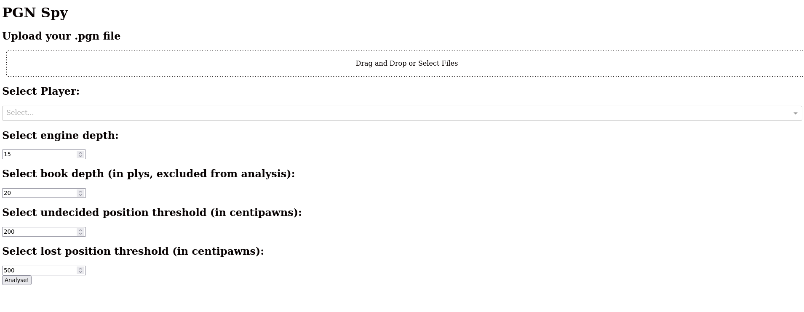

# PyPGNSpy
A tool to locally analyse chess games inspired by [pgnspy](https://github.com/MGleason1/PGN-Spy).  
The programm is based on [uci-analyser](https://www.cs.kent.ac.uk/people/staff/djb/uci-analyser/).

# Features
- Platform-agnostic (Original PGNSpy is windows only)
- Dockerised
- Runs Stockfish 15
- Easy to use with web interface

# Install
1. Clone Repository
2. Docker build `docker build -t pypgnspy .`

# Usage
1. Docker run `docker run --network host pypgnspy` (or forward port 8050 to your local machine)
2. Open localhost:8050 in web browser

# Screenshot

